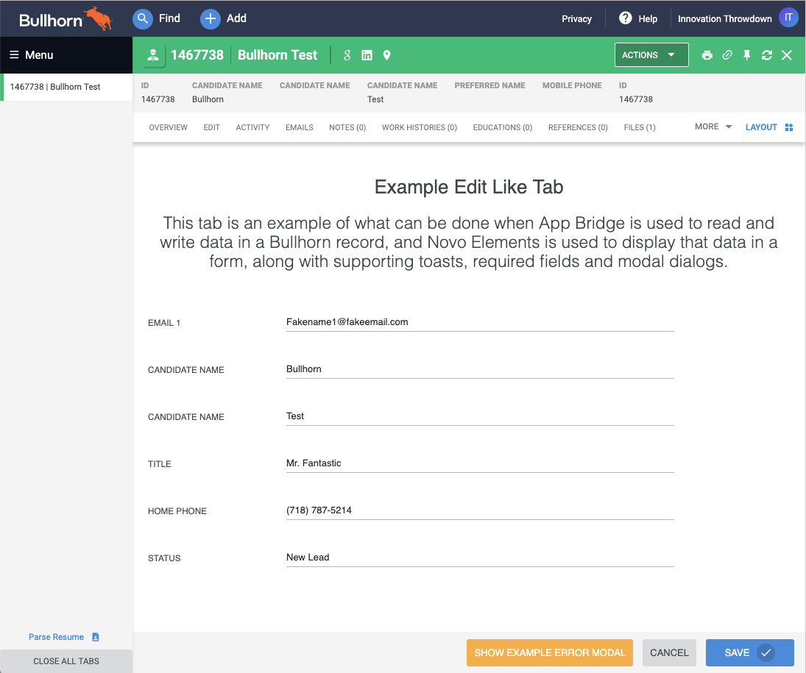

## Candidate Edit Tab

A sample tab for Candidate records that shows an edit form for specific fields as well as custom toasts and modal dialogs.



#### Prerequisites

 * [Host File Hack](../README.md#prerequisites) (One Time Only)

#### Install Dependencies

```npm
npm install
```

#### Run the App

 *  Serve the app at `https://local.bullhornstaffing.com:4201/`:

    ```npm
    npm start
    ```

 * Follow the steps for [Viewing the App Locally](../README.md#viewing-the-app).

 * Follow the steps for [Adding the Extension to Bullhorn](../README.md#adding-to-bullhorn).

 * Open a record in Bullhorn and view your custom extension.
