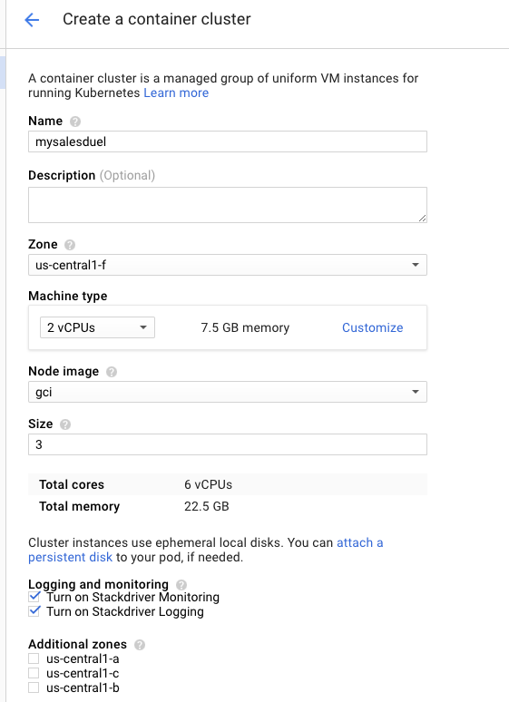
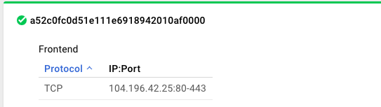
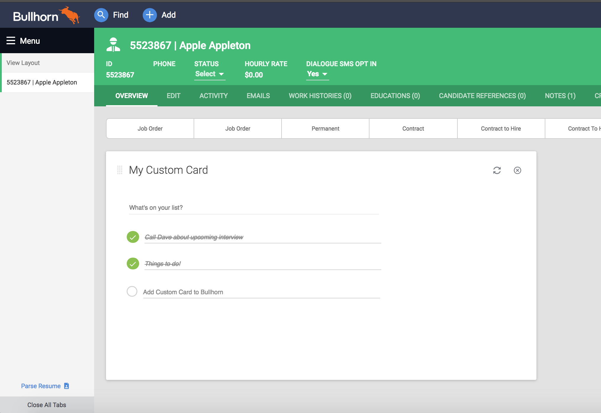

# Custom Card Starter
The goal of this repo is to provide a starting point to creating your own custom cards and using those cards within Bullhorn. The custom-card-starter uses [Angular2](https://angular.io), [angular-cli](https://cli.angular.io/), and Bullhorn's open-source UI library [Novo Elements](https://github.com/bullhorn/novo-elements). For deployment, the custom-card-starter utilizes [Kubernetes](https://kubernetes.io/).

### Prerequisites
 * [NodeJS](https://nodejs.org/en/) - at least v6.9.1
 * [NPM](https://github.com/npm/npm) - at least v3.0
 * [angular-cli](https://cli.angular.io/) - recommended

### Quick Start

```bash
# Clone the repo
git clone https://github.com/bullhorn/custom-card-starter

# CD into the project
cd custom-card-starter

# Install all required dependencies
npm install
npm install -g @angular/cli

# Start the app
npm start
```

Now, navigate to [http://localhost:3000/](http://localhost:3000/) in your browser and code!

## Code scaffolding

Run `ng generate component component-name` to generate a new component. You can also use `ng generate directive/pipe/service/class/module`.

### Testing

## Running unit tests

Run `ng test` to execute the unit tests via [Karma](https://karma-runner.github.io).

## Running end-to-end tests

Run `ng e2e` to execute the end-to-end tests via [Protractor](http://www.protractortest.org/).
Before running the tests make sure you are serving the app via `ng serve`.

## Google Cloud Deployment

### Overview

The purpose of this document is to outline the steps necessary to deploy your own applications, modeled after the custom-card-starter, within Google Cloud. The end result will provide you with an environment with basic fault tolerance utilizing Google Container Service and Kubernetes for orchestration. Although your custom card applications can be hosted within any cloud or self hosted solution, this document utilizes functionality within the Google Cloud service for rapid deployment.

The architecture will consist of a set of vm’s containing node.js containers, a redis container for storing login session information, and a MongoDB cluster to store tournament data.


### Prerequisites

* Google Cloud Account

[https://cloud.google.com/free-trial/](https://cloud.google.com/free-trial/)

* Orchestration of the environment relies on the GCloud SDK and kubectl plugin.  

Please download and install the latest GCloud SDK from: [https://cloud.google.com/sdk/docs/#install_the_latest_cloud_tools_version_cloudsdk_current_version ](https://cloud.google.com/sdk/docs/#install_the_latest_cloud_tools_version_cloudsdk_current_version)

Once installed run gcloud components install kubectl from a terminal/command prompt in order to install the latest kubectl.

* A MongoDB cluster running in Google Cloud. Alternatively you may use a managed MongoDB service provider, we currently reccomend Mlab [https://mlab.com/](https://mlab.com/) as they offer managed clusters within Google Cloud.

* The provided gcloud yamls within the source code for creating the environment.

* Modifications to the source code to reference your MongoDB instances and SSL certificates.

* Your application compiled within nodejs on a docker container.

[https://docs.docker.com/engine/tutorials/dockerimages/](https://docs.docker.com/engine/tutorials/dockerimages/)

* Building and using Node.JS applications

### Creating your cluster

From within google cloud click the Menu and then **Container Engine**.


This will bring you to Container Management. From here you are going to create your initial cluster. Click **Create Cluster** located at the top of the screen.

From here you are going to size your environment. We recommend a 3 node 2vCPU cluster to start. This will also provide your environment with fault tolerance and you may also include additional zones for added fault tolerance.



Once completed click **Create**.

This will take several minutes, you will be able to monitor the progress in the top right of your screen or by clicking **Compute Engine** from the Menu. From here you will see an overview of your environment, you should see 3 compute nodes once this operation has completed.

### Connect your GCloud SDK to the cluster

You can obtain your connection string by going to **Container Engine > Container Clusters** then click connect next to your newly created environment. This should output steps to connect to your cluster similar to the command below. Additionally it provides steps on how to access the Kubernetes UI which is useful for managing the environment.

gcloud container clusters get-credentials mysalesduel \
    --zone us-east1-b --project mysalesduel

### Create the Load Balancer

Run the following command to create your load balancer and container mappings.

kubectl create -f ./gcloud/web.yaml

Once completed you should see your load balancer listed under **Networking > Load Balancing**.



### Deploy Redis

Run the following command to create your redis container.

kubectl create -f ./gcloud/redis.master.yaml

### Building a Custom Card Container

Included within the sourcecode is a base Node.JS dockerfile to get you started. You may build the container by executing the following command within a directory containing your sourcecode. *Remember to make modifications to server/index.js to include your ssl certificates and replace edit the DNS names of your MongoDB instances within server/config/production.json! Additionally the docker file will need to be modified to clone your repository or you may utilize a local npm repository if available.*

docker build -t {{your-app}}:tag .

### Push your container to the Google Registry

Once the VM’s are up you will need to push your docker container to the Google Cloud Registry. The registry is essentially a private docker repository which you will utilize to deploy your containers to the VM’s.

Your private registry name is defined by appending your Google Cloud Platform Console [project ID](https://cloud.google.com/storage/docs/projects#projectid) to one of the available gcr.io hostnames:

* us.gcr.io hosts your images in the United States.

* eu.gcr.io hosts your images in the European Union.

* asia.gcr.io hosts your images in Asia.

* gcr.io without a prefix hosts your images in the United States, but this behavior may change in a future release. To home your data in a single specific location, we recommend specifying one of the localized hostnames. Note that gcr.io and us.gcr.io are not interchangeable in your commands.

Once you've chosen a hostname, append your project ID:

gcr.io/your-project-id/…

To push to the registry:

1. Add the tag to your image:

docker tag user/example-image gcr.io/your-project-id/example-image

2. Then, use gcloud to push the image to the Google Container Engine Registry:

gcloud docker -- push gcr.io/your-project-id/example-image

If completed successfully you should now see your container within the Registry. Click **Container Engine** > **Container registry**. From here you can manually add a friendly tag if needed.



Note the tag, this will be utilized when trying to deploy your application. In this case we’ve added the friendly tag v3.8.14.

### Deploy {{your-app}}

Update the gcloud/{{your-app}}.yaml to reflect the version tag that you used when pushing the container to the Registry. In the example above we would set the following to v3.8.14

spec:

      containers:

      - image: us.gcr.io/salesduel-1076/salesduel:**v3.8.14**

Run the following command to create your application container.

kubectl create -f ./gcloud/{{your-app}}.yaml

This will deploy your application with the specified tag in the yaml. Once completed you should now be able to access your application via the load balancer IP address located within **Networking > Load Balancing**.

### Deploying New Versions

After the environment is up and running you may need to make future code changes. Once you push a new container to the registry you may upgrade an existing environment by running the following command.

kubectl set image deployment/{{your-app}}-deployment {{your-app}}=us.gcr.io/mysalesduel/salesduel:tag
